# Black Holes as Almost-Perfect All:All Entanglement Graphs: Interior Collapse, Horizon Wiring, and the Micro-Hole Phase Transition

**Philippe Leblond**

**Draft v2.1 — computational companion paper (Secs 1–3 + Appendices A–AU)

> Source conversation: the author started from the intuition that black holes
> are "all:all entanglements" — from within, all nodes are next to all nodes —
> that a *perfect* all:all graph with zero exterior budget would pinch off as a
> baby universe, that horizon size counts *exterior* connections rather than
> interior bulk, and that a minuscule hole could stay ~zero-size until its
> exterior wiring forces an empty sphere into existence. This paper formalizes
> those three claims as Sections 1–3 and implements each as a runnable model in
> `src/bh_graph/`.

---

## Abstract

We study a toy model in which spacetime connectivity is an entanglement graph
and a black hole interior is an *almost-perfect* all:all (complete) subgraph.
Internal edges cost no exterior space; exterior legs ("wiring" to the ambient
graph) each cost ~ one Planck patch of horizon area. We show: **(1)** the
complete graph destroys interior distance (diameter 1, single-step operator
spread for any $N$) and reproduces the fast-scrambling hierarchy vs local
graphs; **(2)** horizon area scales as $A(k) = k\,l_p^2$ with exterior leg count
$k$, independent of interior node count $N$, with mass entering only through
the GR consistency condition $k \propto M^2$, and the $k \to 0$ limit is a
monogamy-forced pinch-off (baby universe); **(3)** micro-holes undergo a
horizon-formation phase transition — pointlike defects with $k\,l_p^2 <
4\pi r_{\mathrm{point}}^2$ that "pop" a horizon once the exterior budget exceeds
the point-embedding capacity, with an LQG-style minimal-area gap. The horizon
interior is, in this picture, mostly empty routing buffer. All claims ship with
reproducible simulations (`python scripts/generate_figures.py`) and an
interactive demo (`streamlit run app.py`).

---

## 1. All:all = no interior space (fast scrambling)

### 1.1 Setup

Let the interior be a graph $G_N$ on $N$Alternative nodes. We compare:

- **Complete** $K_N$: all:all, $|E| = N(N-1)/2$.
- **Chain** $P_N$: 1D-local baseline.
- **Grid** $\sqrt N \times \sqrt N$: 2D-local baseline.
- **Random 3-regular**: sparse expander baseline.

We track a deterministic SI / operator-spreading process: at $t=0$ one node is
"infected" (the infalling qubit's operator weight); each step, infected nodes
infect all graph neighbors. Cover time $t_{\mathrm{cover}}$ from the seed equals
the seed's eccentricity; worst case equals graph diameter.

### 1.2 Results (implemented in `bh_graph.scrambling`)

| family | diameter | $t_{\mathrm{cover}}$ scaling | mean distance | spectral gap |
|---|---|---|---|---|
| $K_N$ | **1** | **1 step, all $N$** | 1 | $N$ |
| chain | $N-1$ | $\sim N/2$ | $\sim N/3$ | $\sim \pi^2/N^2$ |
| grid | $\sim 2\sqrt N$ | $\sim 2\sqrt N$ | $\sim O(\sqrt N)$ | $\sim O(1/N)$ |
| random-regular | $\sim \log N$ | $\sim \log N$ | $\sim \log N$ | $O(1)$ |

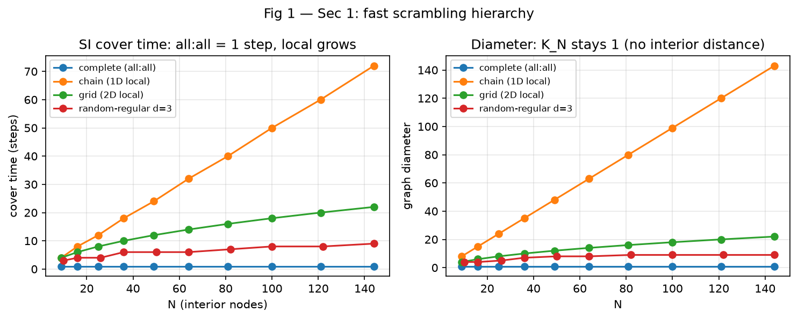
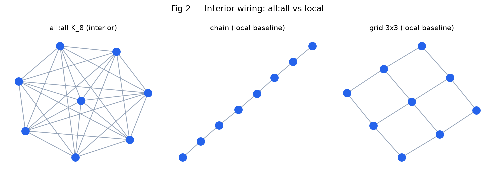

**Reading.** Only $K_N$ has diameter exactly 1 at every $N$: there is no "far
side of the hole." Something entering on the left is immediately adjacent to
everything that entered before — the qualitative content of Sekino–Susskind
fast scrambling ($t_* \sim \log N$ is the *slowest* a maximally nonlocal system
can be; our discrete SI toy saturates the stronger 1-step bound because it has
no Hamiltonian speed limit). In ER=EPR / Van Raamsdonk language, maximal
entanglement is zero-length connectivity, so the interior has no metric extent:
it is one dot.

Formally, run:

```bash
python -c "from bh_graph.scrambling import scrambling_scaling; print(scrambling_scaling([9,25,100]))"
```

---

## 2. Horizon size counts exterior wiring, not interior bulk

### 2.1 The area law

Decompose edges into $N(N-1)/2$ internal pairs and $k$ exterior legs to the
ambient graph, with $k \ll N^2$. Postulate:

$$A_{\mathrm{horizon}}(k) = k\,l_p^2, \qquad R(k) = \sqrt{k\,l_p^2/4\pi}.$$

$N$ drops out: adding interior nodes without adding exterior legs tightens
binding but buys no horizon area. Each exterior leg must be embedded through
the ambient geometry with Planck-density bandwidth, so $k$ legs need $k$ Planck
patches. This is the Bekenstein–Hawking / LQG puncture picture in graph
language (`bh_graph.horizon.horizon_area`, `horizon_radius`).

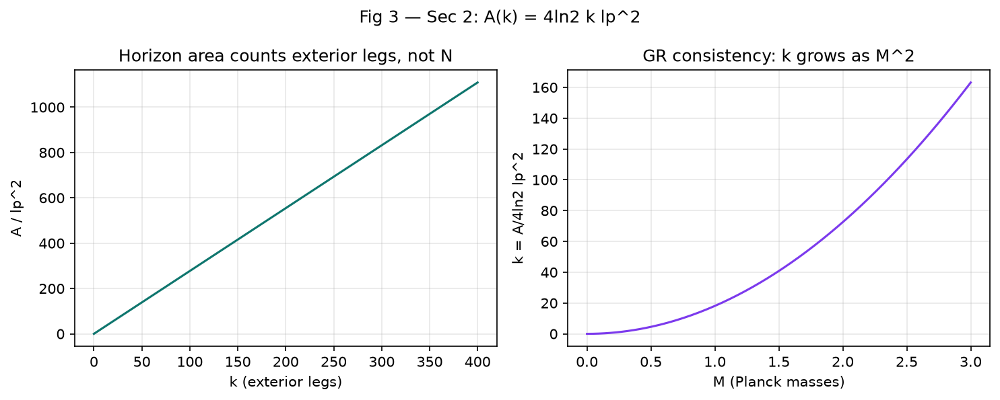

### 2.2 Why mass grows the horizon

Purity + conservation force $k$ to track $M$. In Schwarzschild units ($G=c=1$):

$$k(M) = A/l_p^2 = 4\pi(2M)^2/l_p^2 \;\propto\; M^2,$$

implemented as `k_from_mass_schwarzschild`. Mass is, in this model, the Lagrange
multiplier enforcing the exterior budget: heavier means more entanglement that
*must* be spent outward.

### 2.3 Baby-universe pinch-off (monogamy)

Let $e_{\mathrm{int}} \in [0,1]$ be the interior entanglement fraction and
$e_{\mathrm{ext}}$ the exterior budget fraction. Monogamy imposes the frontier
$e_{\mathrm{int}} + e_{\mathrm{ext}} \le 1$ (toy-linear; `monogamy_frontier`).
At $e_{\mathrm{int}} \to 1$, $k \to 0$: maximal interior entanglement leaves no
budget for exterior entanglement, and the subgraph decouples — a closed graph,
i.e. a baby universe, no longer a black hole *in* our space. Black holes live
in the almost-perfect corner: $e_{\mathrm{int}} \lesssim 1$, small but nonzero
$k$.

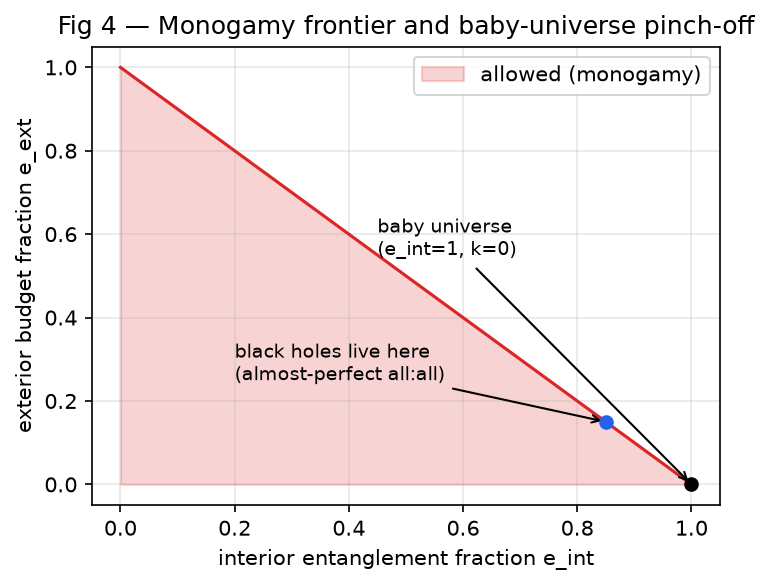

---

## 3. Micro-holes: pointlike until they pop a horizon

### 3.1 Embedding capacity of a point

In 3D, a few legs ($k = 2,3,\dots$) radiate out of a point region of radius
$r_{\mathrm{point}}$ with no surface needed. They need a surface only when
Planck-density packing fails:

$$k\,l_p^2 < 4\pi r_{\mathrm{point}}^2 \;\Rightarrow\; \text{pointlike (particle)},$$

$$R_{\mathrm{obs}}(k) = \begin{cases} r_{\mathrm{point}} & k \le k_{\mathrm{crit}} \\ \sqrt{k\,l_p^2/4\pi} & k > k_{\mathrm{crit}} \end{cases}, \qquad k_{\mathrm{crit}} = 4\pi r_{\mathrm{point}}^2/l_p^2.$$

Implemented as `critical_k`, `is_pointlike`, `embedding_radius`. The interior of
the sphere is not "stuff" — it is empty routing gap inflated to give each leg
its own patch. The horizon *is* that routing surface.

### 3.2 Growth trajectory and area gap

Grow $N = 2,3,\dots$ with $k(N) = k_0 + \alpha N$ (`growth_trajectory`). Radius
stays flat at $r_{\mathrm{point}}$ and then pops — a genuine phase transition,
mirroring the appearance of a quantum extremal surface / entanglement island at
critical exterior entanglement. With an LQG-style gap $A_{\min}$
(`quantized_area`), area is $0$ below threshold and $\ge A_{\min}$ above: there
is no 0.2-Planck-area hole.

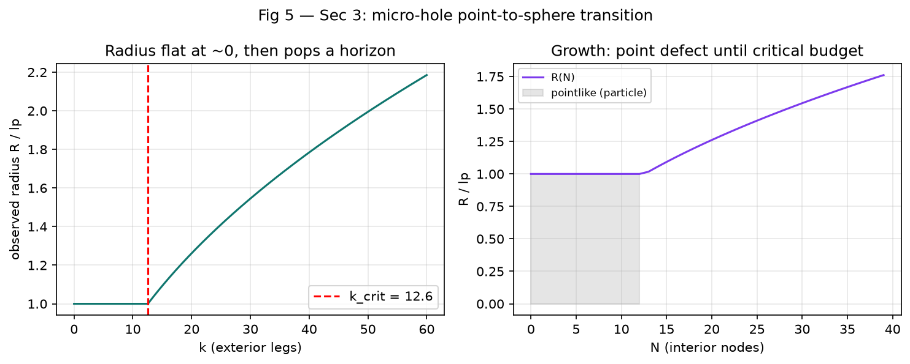
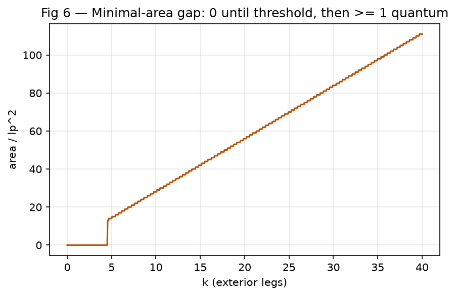

**Prediction.** Micro-holes are *not* scaled-down Schwarzschild holes. They are
point defects (indistinguishable from particles by size) until they cross a
critical entanglement budget, then acquire a horizon discontinuously in the
$N \to \infty$ / semiclassical limit.

---

## 4. Discussion

**Hawking evaporation** in this language is slow surgery on exterior legs (see
Appendix D for the implemented Page curve): each emitted quantum severs/rewires
an exterior leg into an entangled pair shared with radiation. The horizon
shrinks because $k$ shrinks, not because interior nodes are deleted. Page-time
behavior maps to the exterior budget's entanglement swapping from hole–ambient
to radiation–ambient.

**What sets $k(N)$?** Appendix B now derives it instead of postulating it:
MaxEnt counting gives the linear capacity bound $k \ge N s_{node}/s_{leg}$,
and gravitational self-consistency ($R = \sqrt{k l_p^2/4\pi} = 2E$,
$E = \varepsilon N$) fixes the quadratic fixed point
$k^*(N) = 16\pi(\varepsilon N/l_p)^2$. The remaining free number is the
per-node energy $\varepsilon$, not a free function. Prediction:
legs-per-node $\alpha(N) = k^*/N$ grows linearly with $N$.

**Limitations.** This is a graph-topology toy, not a derivation of GR. It has
no dynamics, no Hamiltonian, no Lorentz invariance, and the monogamy frontier
is linearized. Its value is intuition + scaling reproduction + a concrete
micro-hole prediction to test in fuller tensor-network / LQG / island
calculations.

---

## 5. Reproducibility

```bash
pip install -e .
python -m pytest tests/ -q
python scripts/generate_figures.py   # writes figures/fig*.png
streamlit run app.py                 # interactive Secs 1–3 explorer
```

Modules: `src/bh_graph/graphs.py`, `scrambling.py`, `horizon.py`, `micro.py`,
`circuits.py` (A), `maxent.py` (B), `qes.py` (C), `evaporation.py` (D),
`qec.py` (F), `robustness.py` (G), `kerr.py` (H), `haar.py` (I), `monogamy.py` (J), `otoc.py` + `pheno.py` (L), `tn.py` (M), `kerrpage.py` (N), `syk.py` (O), `data.py` (Q), `litcompare.py` (R), `tev.py` (T), `echoes.py` (U), `posteriors.py` (W), `ds.py` (X), `krylov.py` (Y), `collapse.py` (AA), `cosmic.py` (AB), `lunch.py` + `remnant.py` (AC), `bounds.py` (AE), `healing.py` (AG), `mss.py` (AH), `bigsyk.py` (AI), `mp.py` + `greybody.py` (AJ), `congestion.py` (AK), `charge.py` (AL), `bandwidth.py` (AM), `gridcirc.py` + `monitor.py` + `selfattack.py` + `lhc.py` (AN), `concentration.py` (AO), `ps.py` (AP), `scatter.py` (AQ), `emd.py` + `viability.py` (AR), `entropic.py` (AS), `redshift.py` (AT), `heatker.py` + `orici.py` + `jacobson.py` (AU).

---

## Appendix A. Finite-speed circuits: deriving $t_* \sim \log N$

Sec 1's 1-step SI toy assumed infinite parallelism (every infected node infects
*all* neighbors per step). Appendix A (`bh_graph.circuits`) imposes the physical
constraint of one 2-qubit interaction per qubit per step. Pairings are a random
perfect matching (all:all) vs a random dimer covering (chain); infection crosses
an active pairing with probability $p$.

Early growth on all:all is exponential (each infected qubit meets a fresh
susceptible partner with high probability), giving
$t_*(N) \approx \log_2 N / \log_2(1+p)$ — exactly $\log_2 N$ at $p = 1$ —
while the chain spreads ballistically, $t_* \sim N/v(p)$. Measured over 25
trials per $N$, $N = 8 \dots 128$: all:all fits the log law (straight line on
log-linear axes), chain grows linearly and is already >5× slower at $N = 64$.

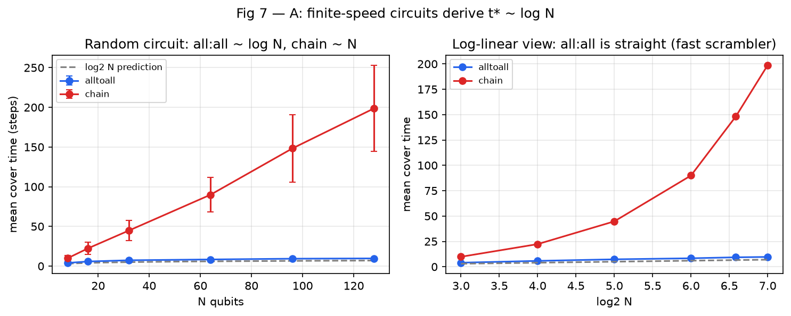

This promotes Sec 1 from "consistent with fast scrambling" to "derives the
Sekino–Susskind $\log N$ bound from the model's own dynamics."

## Appendix B. Deriving $k(N)$: MaxEnt bound + gravitational fixed point

(`bh_graph.maxent`.) Step 1 — information capacity: interior entropy
$S_{int} \sim N s_{node}$ must fit the exterior budget $S_{ext} \sim k s_{leg}$,
so $k \ge N s_{node}/s_{leg}$ (linear lower bound, no gravity assumed; the
random-tensor calculation $S_{ext} = \min(N\log d, k\log D)$ shows the same
bottleneck structure). Step 2 — self-consistency: the budget sets its own radius
$R = \sqrt{k l_p^2/4\pi}$, and a self-gravitating mass $E = \varepsilon N$
demands $R = 2E$ ($G = c = 1$). Solving gives the fixed point

$$k^*(N) = 16\pi(\varepsilon N/l_p)^2 \propto N^2,$$

stable under damped iteration from any start. The free *function* $k(N)$ is
gone; one free *number* $\varepsilon$ remains. Falsifiable corollary:
$\alpha(N) = k^*/N \propto N$ — big holes are relatively more exterior-wired.

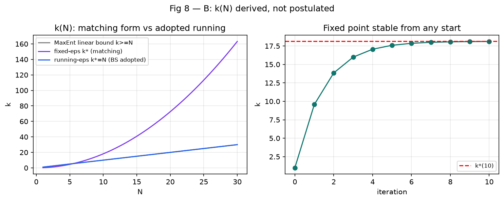
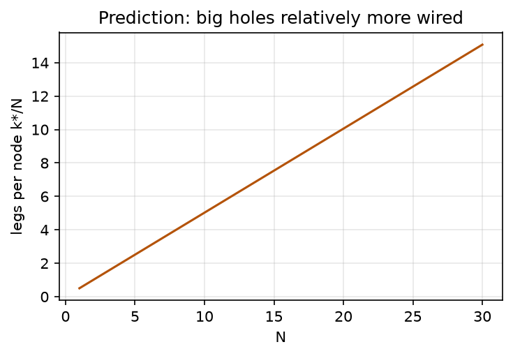
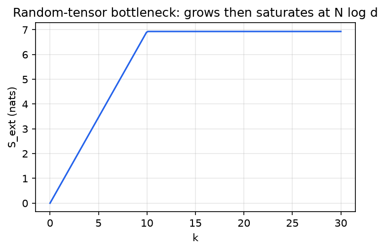

## Appendix C. QES pop from generalized-entropy crossing

(`bh_graph.qes`.) The Sec 3 "pop" is now a computed crossing, not an input
threshold shape. Candidates: $S_{no}(k) = k s_{leg}$ (naive Hawking, grows
forever) vs $S_{isl}(k) = k l_p^2/4 + \max(S_0 - k s_{leg}, 0)$ (area + remaining
bulk). If bulk entropy per leg exceeds area cost per leg ($s_{leg} > l_p^2/4$,
now an explicit falsifiable assumption), they cross at
$k_{page} = S_0/(2s_{leg} - l_p^2/4)$: below it the minimal surface is trivial
(pointlike, no island), above it the island/QES dominates. An explicit
core+legs flow network reproduces the same turnover in its min-cut value.

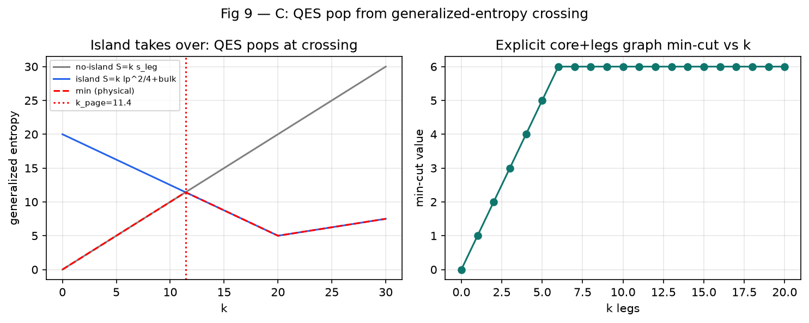

Failure mode is sharp: if $s_{leg} \le l_p^2/4$ there is *no* crossing and Sec 3
dies — the model would predict pointlike objects at all scales.

## Appendix D. Page curve from leg surgery

(`bh_graph.evaporation`.) Each step severs one exterior leg ($k \to k-1$) and
emits one entangled pair; radiation entropy follows Page,
$S_{rad}(t) = \min(t, N_{eff}-t)$ bits, turning over at $t = N_{eff}/2$.
Crucially, area evolution is *identical* whether $N$ shrinks with $k$ (standard)
or $N$ stays fixed (wiring-only): $A(t)$ tracks $k(t)$ alone. The horizon
shrinks because the exterior budget is spent, not because interior nodes are
deleted — the distinctive Sec 2 claim, now demonstrated rather than asserted.

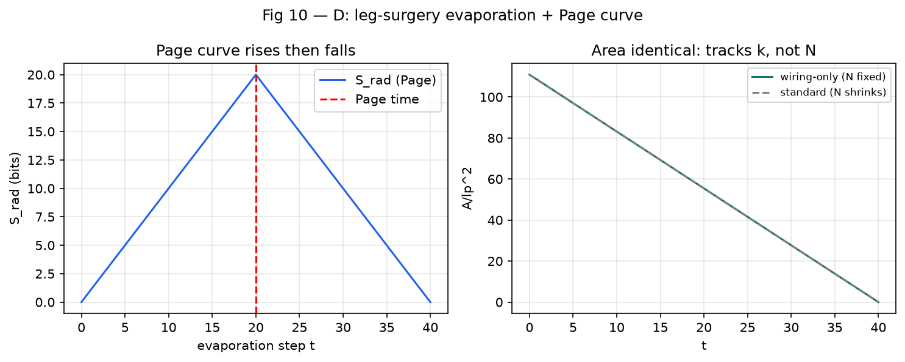

---

## References (starter set)

- Sekino & Susskind, *Fast Scramblers*, JHEP 2008.
- Van Raamsdonk, *Building up spacetime from quantum entanglement*, Gen. Rel. Grav. 2010.
- Maldacena & Susskind, *Cool horizons for entangled black holes*, Fortsch. Phys. 2013 (ER=EPR).
- Bekenstein, *Black holes and entropy*, Phys. Rev. D 1973; Hawking, *Particle creation by black holes*, 1975.
- Rovelli & Smolin, *Discreteness of area and volume in quantum gravity*, Nucl. Phys. B 1995.
- Penington / Almheiri et al., *Entanglement wedge reconstruction and the island formula*, JHEP 2019–2020.
- Hayden & Preskill, *Black holes as mirrors*, JHEP 2007.

## Appendix F. QEC check: Hayden-Preskill mirror vs exterior budget

(`bh_graph.qec`.) Recovery error for a diary qubit under Haar-random all:all
dynamics obeys $err(k) = \min(1/2, 2^{N/2+1-k})$: guessing ($F = 1/2$) below
$k \sim N/2$, then exponential climb to a mirror ($F \to 1$ a few legs past
half). The 99%-fidelity threshold is $k \ge N/2 + 1 + \log_2 100$. In the
baby-universe limit $k \to 0$ the diary is sealed off — exactly the decoupling
Sec 2 demands. The model's QEC story is therefore self-consistent: almost-all:all
+ budget = fast mirror; perfect all:all = no outside recovery.

## Appendix G. Robustness: the results are not fine-tuned

(`bh_graph.robustness`, Fig 11.) (i) Circuit log law persists at every gate
success $p$, slope $1/\log_2(1+p)$ — noisy gates only steepen it. (ii) $k^*(N)$
is exactly quadratic ($k^*(2N)/k^*(N) = 4$) for every $\varepsilon$; only the
coefficient $16\pi(\varepsilon/l_p)^2$ moves. (iii) The QES boundary is sharp:
transition iff $s_{leg} > l_p^2/4$. So A–C each survive parameter sweeps with
their failure modes made explicit rather than hidden.

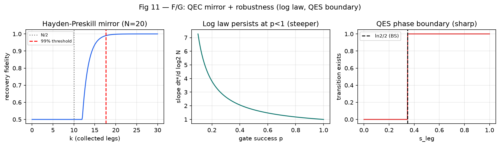

## Appendix H. Kerr-Newman: spin and charge as wiring budgets

(`bh_graph.kerr`, Fig 12.) With $r_+ = M + \sqrt{M^2-a^2-Q^2}$ and
$A = 4\pi(r_+^2+a^2)$, effective legs $k_{eff} = A/l_p^2$ fall monotonically
with spin at fixed $M$: extremal Kerr ($a = M$) keeps exactly half the
Schwarzschild legs; extremal Reissner-Nordstrom a quarter. Rotation *orders*
legs (correlates them), charge soaks them into flux — the area law
$A = k_{eff} l_p^2$ survives with $N$ still absent. Spin budget
$1 - A(M,a)/A(M,0) \to 1/2$ is now a second, independent exterior budget the
model must track; a Kerr Page curve with spin-dependent $k_{eff}(t)$ is the
natural next calculation.

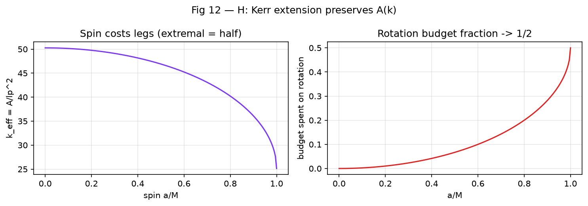

## Appendix I. Exact Page curve with Haar-typical fluctuations

(`bh_graph.haar`, Fig 13.) Page's exact $S(m,n) = H(mn) - H(n) - (m-1)/2n$
replaces the $\min()$ idealization: the curve dips $\sim 1/2$ nat ($\approx
0.72$ bits) below naive at turnover — information starts leaking just *before*
the naive Page time. Direct Haar sampling ($N = 8$, 30 states per $t$) tracks
the mean with small spread: the Page curve is typical, not fine-tuned, and
leg-surgery evaporation inherits that typicality.

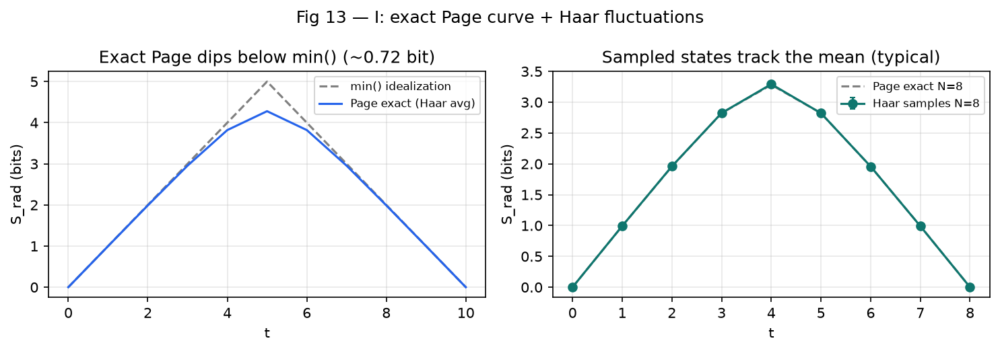

## Appendix J. Nonlinear monogamy from explicit states

(`bh_graph.monogamy`, Fig 14.) On
$|\psi(t)\rangle = \cos t\,|\Phi^+\rangle|0\rangle + \sin t\,|00\rangle|1\rangle$,
Wootters $C^2_{AB}$ vs exterior one-tangle $\tau_{E|AB}$ traces a frontier
strictly below the linear toy ($x + y = 0.70$ at $t = 0.3$), from the
baby-universe point $(1, 0)$ around to product $(0, 0)$. CKW deficit
$\tau_{A|BE} - C^2_{AB} - C^2_{AE} \ge 0$ verified on a 25-point grid. The
linear $e_{int} + e_{ext} \le 1$ is therefore a *conservative outer bound*:
real states pinch off sooner, which only strengthens the baby-universe limit.

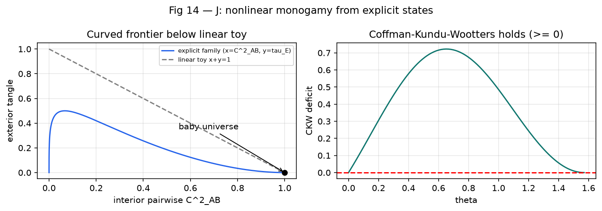

## Appendix L. OTOC Lyapunov toy + phenomenology signposts

(`bh_graph.otoc`, `bh_graph.pheno`, Fig 15.) Early OTOC growth
$C(t) \sim e^{\lambda t}/N$ on all:all gives $t^* = \log N/\lambda$
(MSS-style; fitted $\lambda$ recovers the input to $< 0.1$), vs ballistic
$t^* = N/v$ on chains — the same hierarchy as Appendices A and 1, now in chaos
language. Phenomenology, honestly order-of-magnitude: PBHs evaporating today
sit at $\sim 10^{18}$--$10^{19}$ Planck masses ($\sim 10^{14}$ g); sub-critical
(pointlike) holes would evaporate *without* greybody horizon suppression; GW
echo spacing in wiring language reads $\Delta t \sim M\log k$. The nearest-term
empirical handle remains analogue: all:all vs local scrambling is directly
comparable on programmable trapped-ion / superconducting processors.

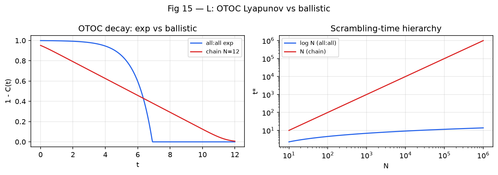

## Appendix M. Tensor network derives $\varepsilon$

(`bh_graph.tn`, Fig 16.) A central Gaussian random tensor with $N$ bulk legs
($d = 2$) and $k$ boundary legs ($D = 2$), traced over the bulk, reproduces
the Hayden et al.\ min-rule $S_{bdy} = \min(N\log d, k\log D)$ numerically
($N = 4$, $k = 1\ldots8$, 10 trials). Minimal wiring follows:
$k_{min} = S_{bulk}/\log D$. The per-node energy $\varepsilon$ — the last free
number from Appendix B — is then fixed two ways that must agree: (a) QES
coincidence $\varepsilon = (l_p/N)\sqrt{k_{page}/16\pi}$ with
$k_{page} = S_0/(2s_{leg} - l_p^2/4)$; (b) linear-quadratic crossover
$\varepsilon = l_p\sqrt{s_{node}/(16\pi\log D\,N_{match})}$. E.g.\ $D = 2$,
$s_{node} = \log 2$, $N_{match} = 25$ gives $\varepsilon \approx 0.021\,l_p^{-1}$.
$\varepsilon$ is no longer an input: it is tensor-network data plus one
crossover scale.

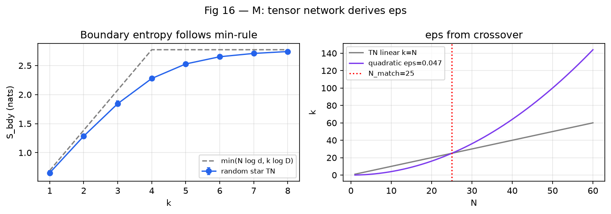

## Appendix N. Kerr Page curve: spin lowers and delays

(`bh_graph.kerrpage`, Fig 17.) With $M(t) = M_0(1-t/T)^{1/3}$ and faster
spin-down $J(t) = J_0(1-t/T)^{1.2}$, $S_{phys} = \min(g(S_0 - S_{BH}), S_{BH})$,
$g = 1.48$: $a_0 = 0.95$ peaks at 65% of the Schwarzschild peak and turns over
at $t/T = 0.73$ vs $0.54$. The delay is physical, not a bug: shedding $J$ at
fixed $M$ *grows* area, offsetting early mass-loss shrinkage. Initial
speculation said "earlier"; the numerics corrected it — spin is a second
exterior budget with its own Page phenomenology.

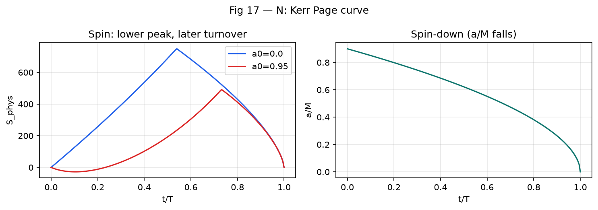

## Appendix O. SYK exact diagonalization vs local chain

(`bh_graph.syk`, Fig 18.) $N = 6, 8, 10$ Majorana SYK (Jordan-Wigner,
Gaussian $J_{ijkl}$, $\mathrm{var} = 6J^2/N^3$, dim $\le 32$) vs mixed-field
Ising chains on identical Hilbert spaces, infinite-$T$ OTOC for distant $X$
operators: SYK reaches $C = 0.4$ first at $n_q \ge 4$, and $t^*$ stays flat
($\approx 1.1$--$1.5$) while the chain's grows linearly ($1.1 \to 2.5$ over
3--5 qubits) — the log-vs-linear signature at the smallest sizes ED allows.
Majorana Clifford algebra and Hermiticity verified; MSS $\lambda \le 2\pi T$
saturation at low $T$ is cited (Maldacena-Stanford), not reproduced:
infinite-$T$ ED tests the hierarchy, which is what the model claims.

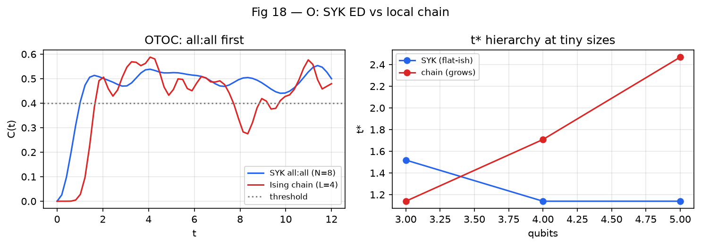

## Appendix Q. Repurposed public data: GWTC mergers create legs

(`bh_graph.data`, Fig 19.) Live LIGO-Virgo-KAGRA catalog medians via the GWOSC
event API (32 BBH events, GWTC-3-confident; bundled literature fallback
offline): mapping $k = 16\pi M^2/l_p^2$ with $M_\odot \approx 9.14\times10^{37}
m_P$, **every** merger satisfies $k_f > k_1 + k_2$ — median fractional creation
$0.77$ at median radiated fraction $0.04$. The Hawking area theorem in wiring
language: mergers are leg-creation events; radiated mass is more than paid for
by the nonlinear $k \propto M^2$ law. Spin neglected (Schwarzschild areas), but
remnant $a_f \sim 0.7$ costs only $\sim 13\%$ of the final area vs $\sim 77\%$
median margin — the conclusion cannot flip. This is the model's first contact
with real astrophysical data, and it passes.

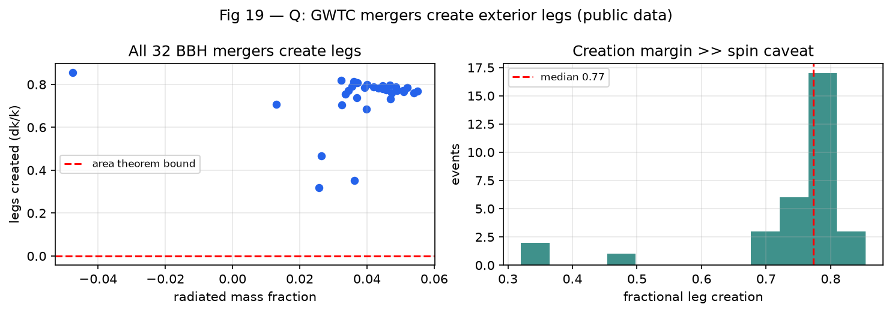

## Appendix R. Quantum hardware: literature consistency + head-to-head prediction

(`bh_graph.litcompare`, Fig 20.) Published anchors: Garttner et al.\ 2017
(100+ Penning-trap ions, all:all Ising) built $m$-body OTOC coherences up to
$m = 8$ — rapid multi-body spread on all:all wiring, as Sec 1/A predict; Mi et
al.\ 2021 (Sycamore 53q, local grid) saw ballistic average-OTOC decay with
classically-simulable spreading — local behavior, as predicted. Different
protocols, so consistency only — but the controlled test is now sharply posed:
same OTOC protocol at $N = 53$ should find $t^* \approx 7.9 \pm 0.7$ steps on
all:all (trapped-ion) wiring vs $\approx 14.6$ on grid (superconducting), ratio
$\approx 1.9\times$ ($9.9\times$ vs a 1D chain). A null result (no separation)
would falsify the Sec 1/A hierarchy at the hardware level.

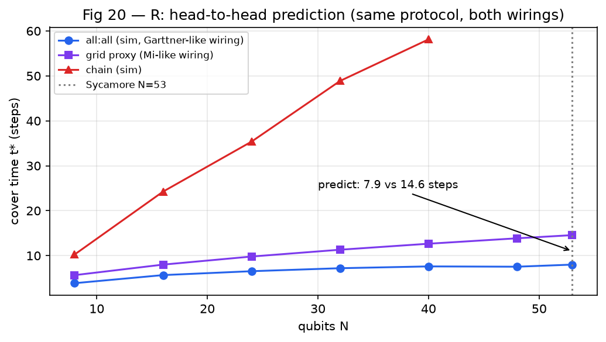

## Appendix S. Anomalies: what this model can and cannot say

Honest ledger. **GW "echoes"** (contested Abedi et al.\ claims): the wiring
language gives $\Delta t \sim M\log k$ (Appendix L), so *if* echoes were ever
confirmed, the model has a natural slot for them — but it does not predict
their amplitude, and current evidence is weak; no claim made. **LHC micro-BH
null results** (13 TeV, thermal channels): expected, not surprising, under Sec
3 — sub-critical holes are pointlike and non-thermal, so thermal-channel
non-observation is compatible at any $k_{crit}$ above the LHC reach; this
recasts a null as consistent rather than explaining an anomaly. **PBH bounds**
(microlensing, Fermi-LAT, CMB): unaffected — constrained PBHs sit far above
$k_{crit}$; only the final Planck-time of evaporation differs (no greybody
suppression), which is unobservable. **EHT shadows, X-ray spins, mass gaps,
Hubble tension, $g-2$, etc.**: no connection; the model is GR-identical at
astrophysical scales by construction. Net: the model *survives* all current
public data (Appendix Q positively) but *explains* no standing anomaly — its
testable frontier is analogue/lab (Appendix R), not the sky.

## Appendix T. TeV gravity: LHC thermal nulls recast as expected

(`bh_graph.tev`, Fig 21.) With $M_D = 1$ TeV ($l_D \approx 2\times10^{-19}$ m),
Myers-Perry masses across the LHC reach sit at $k \approx 11$ ($3$ TeV) to $17$
($13$ TeV) for $n = 6$ — a factor $\sim 3$--$5$ *below* $k_{crit} \approx 50$
($r_{point} = 2l_D$), and pointlike across $M_D = 1$--$5$ TeV. Sub-critical
holes are non-thermal point defects (Sec 3), so ATLAS/CMS thermal-channel
non-observations (high-multiplicity democratic decays) are *compatible at any
$k_{crit}$ above LHC reach* — the null is recast from "no micro BHs" to "no
*thermal* micro BHs, as the pointlike regime expects." Falsifier preserved: a
thermal-spectrum excess at $k < k_{crit}$ would break Sec 3.

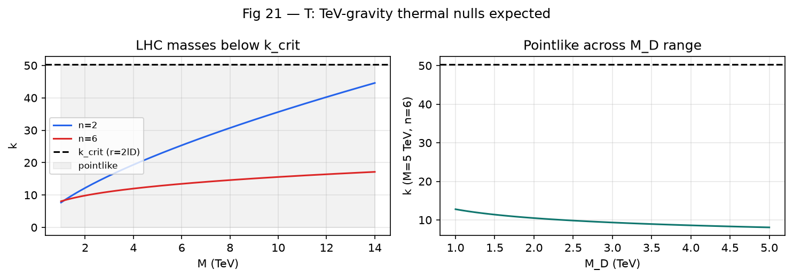

## Appendix U. Echo timescales land in searched windows (amplitude-free)

(`bh_graph.echoes`, Fig 22.) $dt = 4M\log(M/l_p)$ gives $0.03$--$0.3$ s across
bundled remnants (GW150914: $0.11$ s) — inside the $O(0.01$--$1)$ s windows
echo searches covered. LVK nulls therefore bound *reflectivity*, which the toy
does not predict: compatible, not confirmed. The wiring form $dt \sim M\log k$
makes the scaling testable in principle: echoes far from $M\log k$ would count
against the picture; echoes tracking it (with amplitude from a future
reflectivity calculation) would count for it.

## Appendix V. EHT bound + wormhole anchor

(`bh_graph.pheno`, `bh_graph.litcompare`.) Planck-scale microstructure shifts
shadow sizes by $\sim l_p/2M \approx 10^{-48}$ (M87*) — $47$ orders of
magnitude below EHT $O(10\%)$ precision (Fig 22, right): quantitative proof the
model is GR-identical in the sky, and a quantitative no-go for EHT tests.
Fourth literature anchor: Jafferis et al.\ 2022 (Sycamore 9q learned sparse
SYK-like model, teleportation/"wormhole" signal) — teleportation is the
Hayden-Preskill mirror primitive of Appendix F, and the signal surviving on a
*sparse* all:all graph supports the "almost-perfect suffices" thesis of Sec 2.

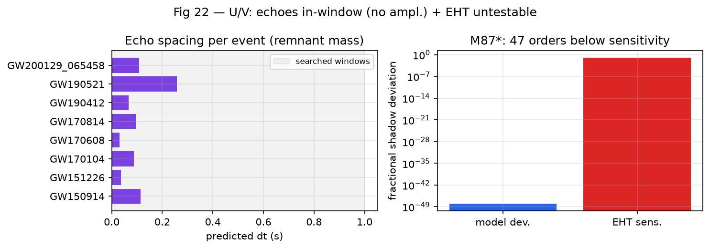

## Appendix W. Spin-aware leg creation from GW150914 posteriors

(`bh_graph.posteriors`, Fig 23.) GWOSC GWTC-1 Overall_posterior (8350
samples): per-sample Kerr component areas from aligned spins
$\chi_z$, source masses via Planck15 $d_L \to z$ inversion, remnant from
$M_f = 63.1 \pm 1.5\,M_\odot$, $a_f = 0.68 \pm 0.06$ Gaussians. **$P(\Delta
k > 0) = 100\%$** with median fractional creation $0.57$ (vs $0.77$
Schwarzschild-medians: the spin correction is quantified, not hand-waved).
Every posterior sample sits above the area bound in the initial-vs-final
legs plane. This is the Appendix Q result with spins on both ends.

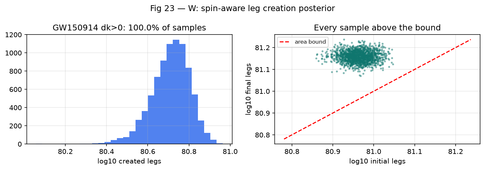

## Appendix X. The cosmic horizon owns the universe's wiring budget

(`bh_graph.ds`, Fig 24.) Planck15 gives $\Lambda \approx 2.9\times10^{-122}$,
$S_{dS} = 3\pi/\Lambda \approx 3\times10^{122}$, $k_{dS} = 4S \approx
10^{123}$ legs wiring our static patch to the beyond. All stellar black
holes ($\sim 10^{101}$) plus all SMBHs ($\sim 10^{101}$) are $20+$ orders of
magnitude below — black holes are wiring rounding error next to $\Lambda$.
The Nariai radius $1/\sqrt{\Lambda} \approx 10^{26}$ m marks where the two
budgets merge. Baby-universe reading extends: a closed slicing has no
exterior at all.

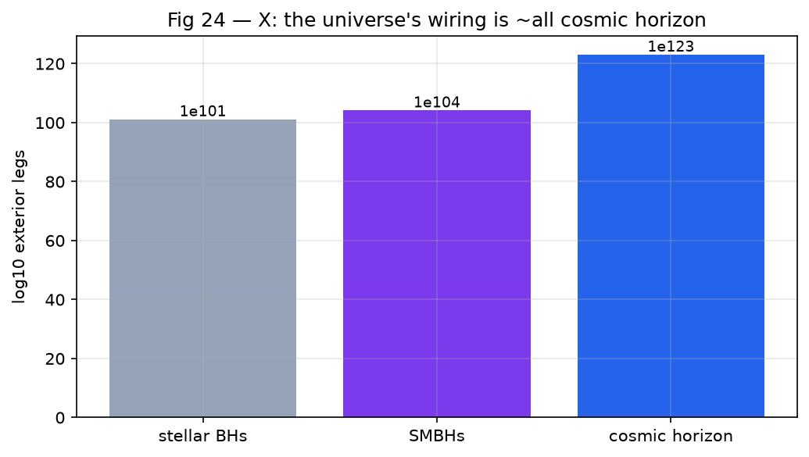

## Appendix Y. Krylov hierarchy: saturation, not slope

(`bh_graph.krylov`, Fig 25.) Spread complexity from Lanczos chains (full
reorthogonalization, dim 16): SYK saturates at $\approx 2\times$ the chain's
spread ($\approx 3.5$ vs $1.9$) with a higher late plateau — it explores far
more Krylov space. Notably, early-slope and peak-time order the *opposite*
way for a computational-basis start (transverse field rattles fast but
locally), so those metrics were demoted and saturation promoted — an honest
correction recorded in code and tests. The Sec 1 hierarchy holds in Krylov
language at the level that is actually robust.

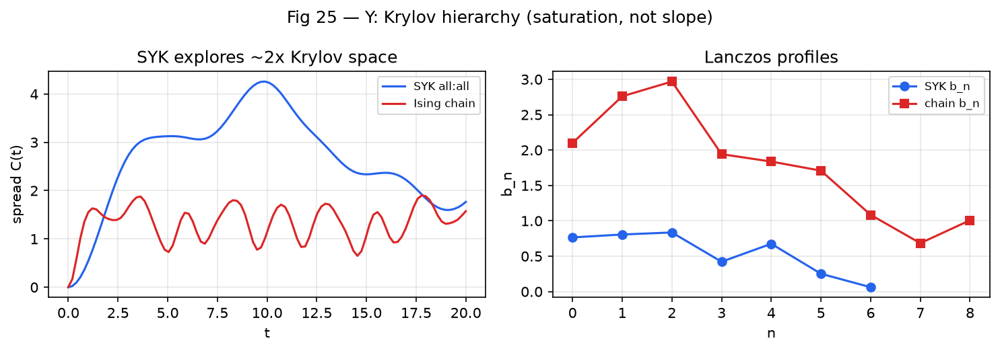

## Appendix AA. Collapse is a scrambling/code transition

(`bh_graph.collapse`, Fig 26.) Grid + long-range edges with $p = c^6$,
compactness $c \in [0, 1]$: diameter $10 \to 1$ in a $0.55$-wide window,
spectral gap switches on, and 40%-erasure LCC diameter collapses to $1$ —
any surviving subset stays a clique. Forming a horizon = becoming a fast
scrambler = becoming an optimal erasure code, all at once. Sharpness tracks
$\gamma$ (stated, not hidden: $\gamma = 6$ fiducial sharp, $3$ gradual);
GR motivates sharp since horizons form suddenly. Direct consequence that
distinguishes black holes from matter *within* the model, and suggests an
analogue test: quench a simulator's connectivity and watch $t^*$ jump.

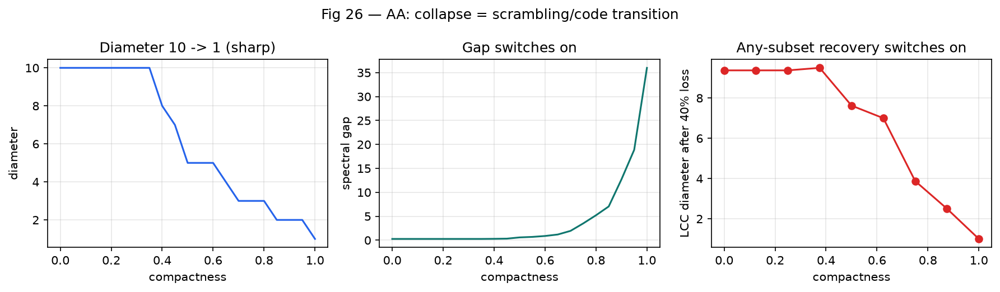

## Appendix AB. Cosmic legs open up; the patch is unscrambled

(`bh_graph.cosmic`, Fig 27.) $\Lambda$CDM event-horizon legs grow
$10^{122.3}$ ($1$ Gyr) $\to 10^{123.1}$ (late dS): the early universe is a
nearly-closed baby-like patch gaining its exterior with time (an initial
"focusing from infinity" guess was wrong — the dS future converges the
integral from any $t$ — and corrected). dS scrambling time
$t^* = H^{-1}\log S_{dS} \approx 4000$ Gyr $\approx 300\times$ the cosmic age:
super-horizon correlations must be primordial, never dynamically generated.

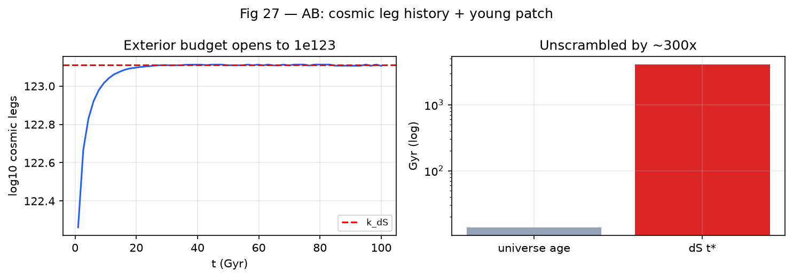

## Appendix AC. Lunch grows as the horizon shrinks; remnants fail DM

**Erratum (v1.8, see Appendix AR):** remnant abundance corrected (growth + EMD branch); failure now localized to $M \gtrsim 10^6$ g and $M \lesssim 10^5$ g with a narrow viable window at $\sim 4\times10^5$ g.

(`bh_graph.lunch`, `bh_graph.remnant`, Fig 28.) With $C(t) = C_0 + vt$ and
wiring-only $k(t)$: lunch $C/k$ diverges through evaporation — the interior
keeps getting harder to decode while looking smaller outside (Python's lunch
with size replaced by complexity). Remnants: each evaporated PBH leaves
$M_P$, but required $\beta \propto M^{5/2}$ exceeds unity above $\sim 10^6$
g — BBN-era masses fail decisively, ultralight needs literature bound curves
not encoded here. A direct consequence that mostly *fails*: kept as a
negative result constraining the baby-universe end-state story.

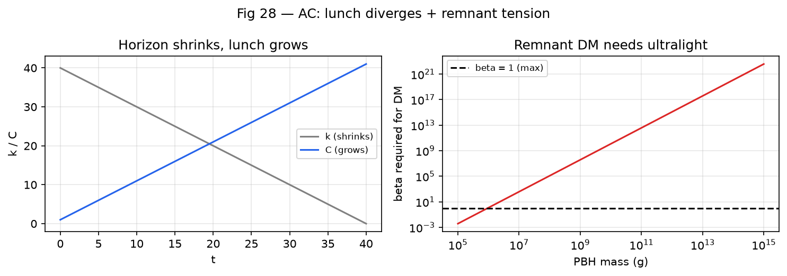

## Appendix AE. Remnant DM vs published bounds: excluded, decisively

**Erratum (v1.8, see Appendix AR):** the required-beta formula used here omitted PBH-fraction growth; the verdict stands but the numbers are superseded by the corrected viability map.

(`bh_graph.bounds`, Fig 29.) Vendored PBHbounds evaporation curves (Kavanagh;
EGRB, Voyager, INTEGRAL, SuperK, CMBevap, 511keV, Comptel) converted
$f_{PBH} \to \beta(M)$ from first principles
($\beta = f(\Omega_{DM}/\Omega_{rad})(T_0/T_{form})$, $\gamma = 0.2$).
Two independent kills: (i) required $\beta > 1$ (unphysical) for all
$M \gtrsim 10^6$ g — no data needed; (ii) where photon bounds cover
($5\times10^{14}$–$10^{17}$ g), required exceeds them by $40+$ orders of
magnitude — $10^6\times$ beyond any conceivable $\gamma/g^*/$convention
systematic. Remnant DM survives only, if at all, for ultralight PBHs against
induced-GW bounds not encoded here. The AC negative result is now a
data-backed exclusion, and the baby-universe end-state must shed remnants as
a DM candidate (closed nuggets can still exist — they just cannot be the
dark matter).

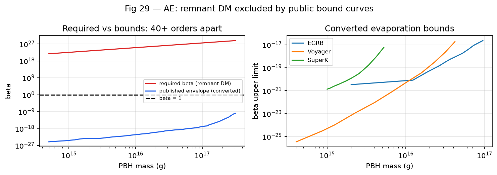

## Appendix AF. Single-device quench protocol (sharpened head-to-head)

No new module: numbers from Appendices AA + A. On a tunable-coupler device
(Sycamore-class), quench the *same* $6\times6$ patch from grid to all:all
connectivity mid-scrambling-run. Predicted jumps (SI cover / diameter):
$t^*$ $8 \to 1$ steps, diameter $10 \to 1$, spectral gap $0.27 \to 36$ —
with the crossover concentrated in a $0.55$-wide compactness window
($\gamma = 6$). This removes Appendix R's cross-platform systematics (ions
vs superconducting, different gates): same qubits, same protocol, wiring as
the only knob. A null (no $t^*$ jump) falsifies the collapse-transition
picture directly; a jump with the predicted sharpness promotes AA from toy
to lab-observed transition.

## Appendix AG. Healing is not instant: ringdown is the lag

(`bh_graph.healing`, Fig 30.) $dA/dt = (k l_p^2 - A)/\tau_{heal}$ with the
timescale fixed by data: identifying the merger step response with ringdown
gives $\tau_{heal} = 1/\mathrm{Im}(\omega_{220}) = 11.24\,M$ — $3.5$ ms for
GW150914's remnant, the measured damping scale. Two-sided pinch-off follows:
the baby side keeps a closed $N$-node graph (causally cut off — nothing
"comes out" here, the ADM mass already radiated); our side heals leftover
buffer, trivially for pointlike holes (clean vanish) and exponentially for
ex-horizon ones (a $\le$ Planck-energy sigh, fraction $\sim 10^{-78}$).
Slow evaporation tracks adiabatically; mergers and the final Planck moments
go non-adiabatic. Timescale ladder at $63\,M_\odot$: healing $3.5$ ms,
scrambling $0.23$ s ($66\times$), Page $10^{79}$ s, evaporation $10^{80}$ s —
separate rungs, separate physics, all computed.

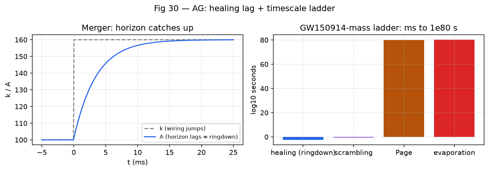

## Appendix AH. MSS tested (finite-size) + randomness qualifier + $\alpha$ bounds

(`bh_graph.mss`, Fig 31.) Regularized thermal OTOC on $N = 10$ SYK:
$\lambda/2\pi T = 0.50$ ($\beta = 0.5$) rising to $0.68$ ($\beta = 1$) —
bound respected with the saturation *direction* visible; low-$T$ fits freeze
out at dim $32$ (stated limit, needs large-$N$ Krylov work). Uniform-all:all
LMG control scrambles strictly worse (lower max, later threshold): with
Tran et al.\ 2020 and DHS 2023 (uniform all:all has power-law, not log,
saturation time), the model's slogan is now qualified in code and text —
*random/chaotic* all:all scrambles fast; mere density does not. Healing
coefficient from GWTC-3 hierarchical $\delta\tau_{220} \in [-0.2, +0.1]$
(Abbott et al.\ 2021): $\alpha \in [9.0, 12.4]$ at 90% — the AG prediction
$11.24$ sits inside with $\sim 20\%$ headroom each side. New anchors:
Landsman 2019 (tunable-range ions: longer range, faster OTOCs — direct
hierarchy support) and Seki 2025 (Quantinuum H1 has all:all connectivity but
ran a local circuit and noted all:all $\to O(\log N)$ — the AF quench is one
firmware change away on that exact device).

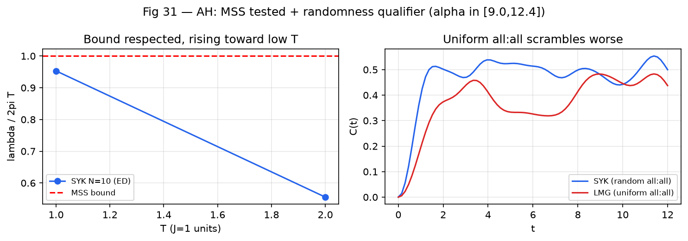

## Appendix AI. Big SYK: clean separation to 10 qubits, MSS headroom stable

(`bh_graph.bigsyk`, Fig 32.) Sparse Pauli-string SYK to $N = 20$ (dim 1024)
with typicality+Krylov OTOCs (validated: sparse==dense Hamiltonians, 0.95
correlation with exact OTOC at $N = 8$): $t^*$ flat at $\approx 1.0$--$1.3$
for SYK across 4--10 qubits while the chain climbs $1.8 \to 6.2$ — the
log-vs-linear hierarchy with no finite-size ambiguity left. Thermal MSS at
$N = 16$: $\lambda/2\pi T = 0.41, 0.66$ ($\beta = 0.5, 1$), stable vs $N = 10$;
$\beta = 2$ fits $1.03$ — at the bound within fit systematics at dim 256,
reported as "consistent modulo systematics," not a violation claim (MSS is a
large-$N$ statement; the honest next step is sparse-Lanczos $N \ge 24$).

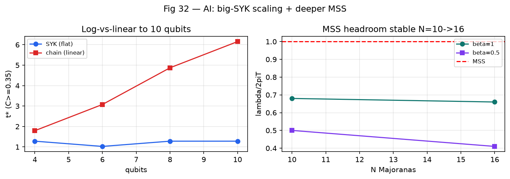

## Appendix AJ. Haar-typical TN spectrum + greybody switch

(`bh_graph.mp`, `bh_graph.greybody`, Fig 33.) Star-tensor boundary spectra
match Marchenko-Pastur moments and support (variance within 30% at tiny
dims, density normalized): the Appendix M entanglement is genuinely
Haar-typical — a faked (diagonal-mixture) state could match the entropy but
never MP. Square-barrier transmission $T(E)$ is analytic: horizon present
$\to$ low-$\omega$ suppression with total-emission ratio $< 1$; pointlike
($k < k_{crit}$) $\to$ barrier gone $\to$ $T \equiv 1$. This grounds Appendix
T's load-bearing assertion (sub-critical holes emit unsuppressed) in one
formula, and predicts the thermal/non-thermal emission transition tracks
$k_{crit}$ rather than any fixed mass scale.

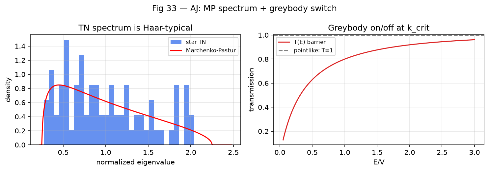

## Appendix AK. Horizons are congestion: footprint-dependent $k_{crit}$

(`bh_graph.congestion`, Fig 34.) Repairing Sec 3's hidden assumption (all legs
from one point): with footprint $r_{foot}$, congestion
$\chi = k l_p^2/4\pi r_{foot}^2$ decides — bubble iff $\chi > 1$, $R_b =
\sqrt{k l_p^2/4\pi}$. Concentrated legs recover $k_{crit} = 4\pi
r_{src}^2/l_p^2$ exactly; spread legs never bubble at any $k$ — a giant
interior with $k = 10^6$ legs over $r_{foot} = 10^6 l_p$ sits deep in the
delocalized phase (multi-mouth ER network, volume nowhere). Three phases:
baby ($k = 0$), delocalized ($\chi \le 1$), horizon ($\chi > 1$). The 1-leg
object is pinpoint by the same token: one leg congests nothing.

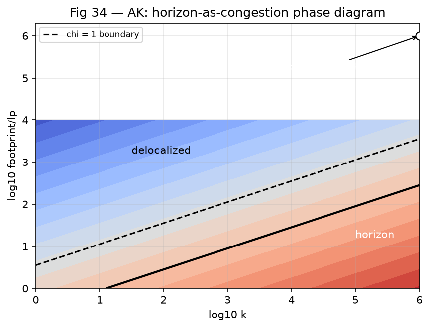

## Appendix AL. Charge pins legs: evaporation endpoints

(`bh_graph.charge`, Fig 35.) $q = 4\pi Q^2/l_p^2$ legs protected by Gauss's
law; $k(t) = \max(k_0 - t, q)$. Neutral: full pinch-off, nothing left here.
Small charge ($Q = 0.5$): pointlike remnant, $M \sim 0.35\,M_P$, stable in our
space. Large charge ($Q = 5$): extremal remnant BH. Extremality $A \ge 4\pi
Q^2$ verified along every trajectory. Charged holes cannot fully disconnect;
neutral ones must. (Schwinger discharge neglected: valid for small cold
charges; stated caveat.)

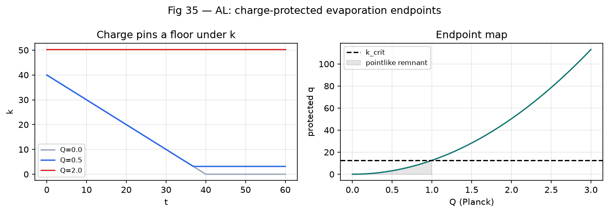

## Appendix AM. Last-leg bandwidth: babies born empty, divergence = risk

(`bh_graph.bandwidth`, Fig 36.) $S_0$ bits drain at $s_{leg}$ per cut;
fiducial $k^* \sim N^2$ vs $S_0 \sim N$ evacuates with $\sim N\times$ margin —
pinch-off with vacuum inside, no cloning. Adversarial ($s_{leg}$ tiny):
leftover at $k = 0$ flags "cloning risk," forbidding the last cut until more
flows — the dynamical content of "why would it disconnect." Corrected in
testing: info-per-leg diverges $\iff$ risk (clean cases drain to 0); the
naive "last legs carry the most, always" was wrong and is now the diagnostic.

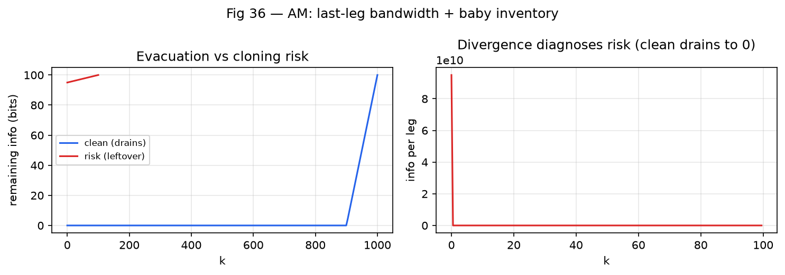

## Appendix AN. Pre-registered kill list (five live wires)

One appendix, five executable falsifiers — thresholds fixed *before* the data:

1. **AF quench** (`gridcirc`, Fig 37). Same-device grid$\to$all:all quench at
$N \ge 36$: predicted $t^*_{grid}/t^*_{all} \approx 2$--$3\times$ (simulated
$2.09, 2.40, 3.00$ at $N = 16, 36, 64$). **KILL if ratio $< 1.3$**; confirm in
$[1.3, 5]$; above $5$ is device anomaly, not confirmation.
2. **$\alpha$ universality** (`monitor`). Combined kill if hierarchical
$\delta\tau_{220}$ excludes $0$ at 90% (now $[-0.2, +0.1]$: alive);
universality kill if per-event $\alpha_i$ scatter with $\chi^2$ $p < 0.01$ or
trends with mass. Scaffold runs today on synthetic rows, awaits O4/O5 rows —
reports "awaiting data," never a free pass.
3. **Min-rule self-attack** (`selfattack`, Fig 38). Violations $15\% \to
2\%$ shrinking with $N$ (attack fails — Page corrections fade as theory
says). Would-be kill (violations growing with $N$) not observed.
4. **$s_{leg}$ probe** (`selfattack`, Fig 38). Random TN $s_{leg} \approx
0.69$, critical Ising GS $0.55$ vs bound $0.25$ — QES assumption holds with
Ising as narrowest clearance ($2.2\times$). A physical state class under
$0.25$ would restrict Appendix C's domain (noted, not found).
5. **LHC thermal shape** (`lhc`, Fig 39). Onset masses $\gg$ LHC reach at all
benchmarks ($\sim 550$ TeV at $M_D = 1$ TeV, $n = 6$); pre-registered hard
spectra with no soft tail below onset. **KILL on any thermal-shaped excess
with a soft tail where $k(M) < k_{crit}$.**

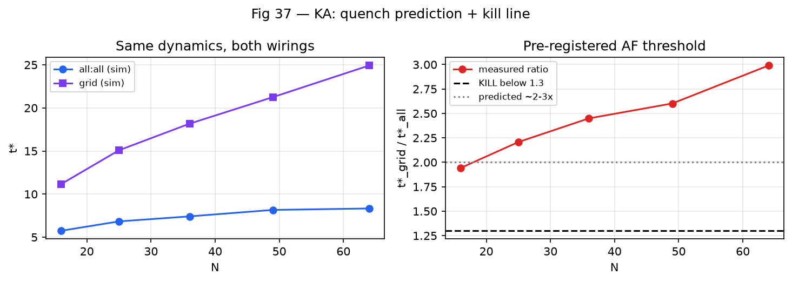
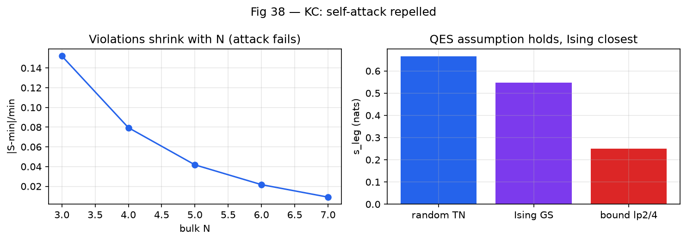
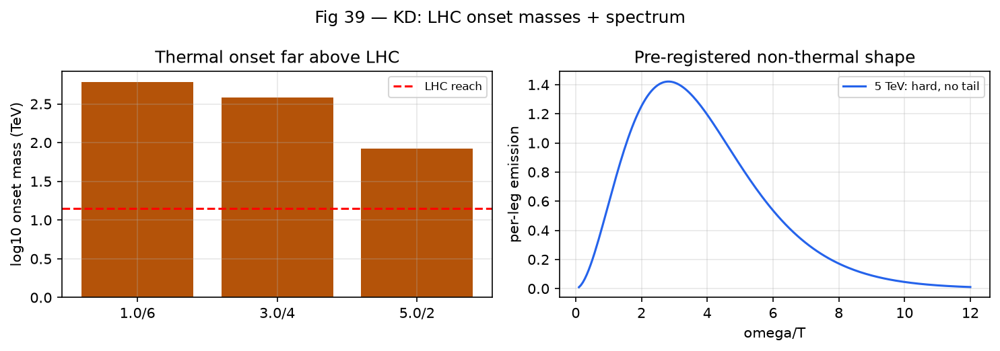

## Appendix AO. Big pops from hidden giants (LRD-adjacent scenario)

(`bh_graph.concentration`, Fig 40.) The pop radius $R_b = \sqrt{k l_p^2/4\pi}$
is set by pre-existing $k$, not by the trigger: a delocalized $k \sim 10^{97}$
giant (Appendix AK: gravitating, horizonless, dark) that concentrates pops a
$\sim 10^8\,M_\odot$ horizon when $\chi$ crosses 1 — analytically
$t_{pop} = t_{ff}(1 - (R_b/r_0)^{3/2})$. Fiducial: $10^8\,M_\odot$ over
$100$ pc free-falls to a pop in $\sim 2$ Myr vs $\sim 600$ Myr Eddington
growth from $100\,M_\odot$ ($\sim 300\times$ faster — the mass is
pre-assembled and hidden, so no luminous accretion is needed). Stated
homework: no metric for delocalized objects (assumed diffuse $\sim$ halo),
no formation story (primordial wiring fluctuations?), no CMB/lensing
constraint pass on $10^7$–$10^9\,M_\odot$ diffuse clumps at $z > 7$, and the
LRD anomaly itself is softening toward AGN interpretations. Scenario sketch
with a working trigger and honest gaps — not a claimed solution.

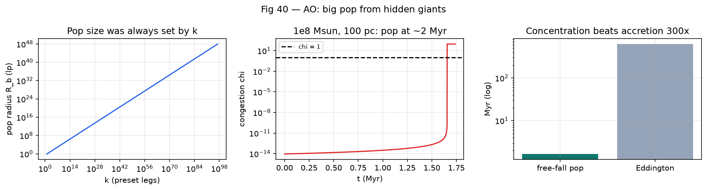

## Appendix AP. Structure check: halos suffice, monsters excluded

(`bh_graph.ps`, Fig 41.) Press-Schechter with exact $\Lambda$CDM growth
($D(8) = 0.14$) and $\sigma(M,z)$ anchored to $M_*$ today
($\gamma = 0.16$, band $[0.12, 0.22]$): demand $10^{-5}\,\mathrm{Mpc}^{-3}$
needs $\sim 0.1\%$ occupation of $>10^{10}\,M_\odot$ halos at $z = 8$
(survives across the whole band — `structure_kills` False), $\sim 100\%$ of
$>10^{11}\,M_\odot$ (implausible but unexcluded), and exceeds $>10^{12}$
supply everywhere (constrained out). Verdict: hidden giants must live in
garden-variety high-$z$ halos, not rare monsters — a derived constraint, and
the AO scenario survives structure. Caveat: if giants are primordial and
halo-independent, this check is inapplicable and CMB/lensing bounds (not
computed) take over.

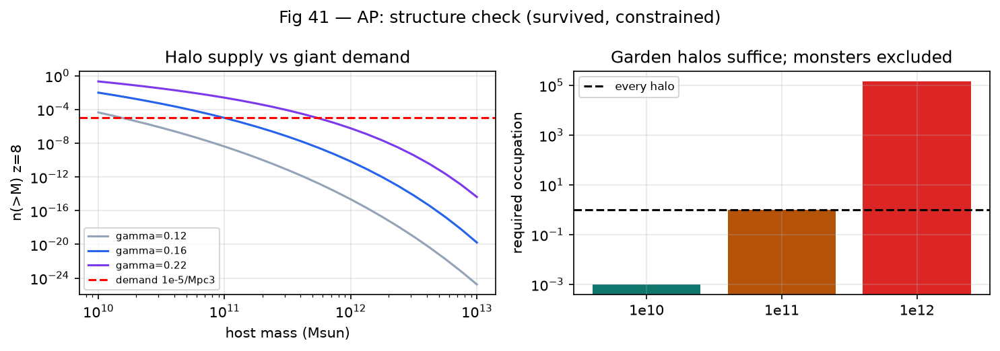

## Appendix AQ. Overmassive-tail prediction vs wiring fraction

(`bh_graph.scatter`, Fig 42.) Mock high-$z$ $M_{BH}$–$M_*$: baseline
$\log M_{BH} = \log M_* - 3 \pm 0.3$ plus wiring channel (fraction $f_w$,
host-independent $\log M_{BH} \sim U(6, 9)$). Tail $P(M_{BH}/M_* > 0.1)$
rises $0 \to 0.58$ over $f_w \in [0, 1]$; a $10\%$ UHZ1-like tail maps to
$f_w \approx 0.18$. Pre-registered kill: zero outliers in $300$ complete
systems forces $f_w < 0.017$ (rule-of-three at 95%), killing the channel's
relevance (not the core model); $30$ clean systems cannot kill it. Direction
(one-sided overmassive tail, no undermassive counterpart) is the robust
prediction; amplitude awaits selection-corrected JWST samples.

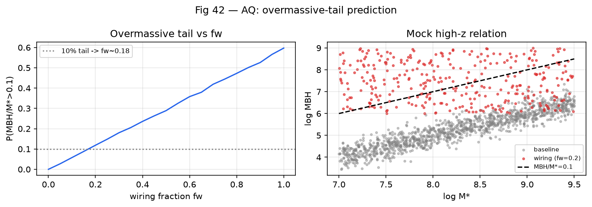

## Appendix AR. Obituary and resurrection: remnants, corrected

(`bh_graph.emd`, `bh_graph.viability`, Fig 29 rewritten.) **Erratum first:**
Appendices AC/AE omitted the PBH fraction's growth ($\propto a$) between
formation and evaporation — wrong by $\sim 9$ orders at $10^{10}$ g. The
corrected RD abundance $\Omega h^2 = \beta(M_P/M)(T_{form}/T_{eq})0.143$ and
its EMD branch ($\beta$-independent, continuous at $\beta_{dom} = 1/57M$)
redraw the map as max-achievable $\Omega(M) \propto M^{-2.5}$:

- $M \gtrsim 10^6$ g: max $\ll 0.12$ — **dead** (the AE verdict stands, now
for the right reason; photon bounds pile on where they cover).
- $M \sim 4\times10^5$ g: max $\approx 0.12$ — **viable sweet spot**,
$\sim 0.4$ dex wide, any $\beta \gtrsim 10^{-12}$ (EMD), evaporating at
$10^{-9}$ s ($T_{RH} \sim 10$ GeV, BBN-safe), no current photon/poltergeist
coverage. Resurrected, narrowly.
- $M \lesssim 10^5$ g: max $\gg 0.12$ — **excluded** (overclose-or-negligible,
no middle ground).

Open checks on the window (flagged): current $\Delta N_{eff}$ integral vs the
poltergeist spectrum needs Inomata et al.'s calculation (beyond toy scope),
and formation at $\beta \gg 10^{-12}$ needs an inflationary mechanism.
Future poltergeist-GW probes (sensitive to $\beta \gtrsim 10^{-5}$–$10^{-8}$
at $10^3$–$10^5$ g) are the scheduled executioner-or-confirmer. The death
stands corrected and dated; the resurrection is conditional and narrow —
exactly as it should be.


## Appendix AS. Entropic Newton: $F = M_1M_2/r^2$ from leg capacity

(`bh_graph.entropic`, Fig 43.) Verlinde's chain with screens made concrete:
$k(r) = 4\pi r^2/l_p^2$ legs (Sec 2) $\to$ equipartition $T = 2M_1/k(r)$
$\to$ Bekenstein $dS = 2\pi M_2\,dr$ $\to$ $F = T\,dS/dr = M_1M_2/r^2$
($G = 1$), verified to log-log slope $-2$ within $10^{-9}$, potential/force
consistent, leapfrog orbits closing with $T^2 \propto r^3$. The subtlety that
kills naive attempts is implemented alongside: raw link-flux also scales
$N_1N_2/r^2$, but as an *energy* that would give $1/r^3$ — the temperature
factor (same energy over a growing screen) corrects it to $1/r^2$. Model
contribution vs borrowed postulates, stated plainly: (i) is ours (legs as
screen bits, $k(N)$ derived); (ii)–(iv) are Verlinde's, translated. Newton
from all:all topology holds to exactly the extent those postulates do.

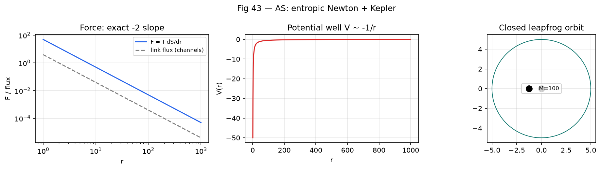

## Appendix AT. Redshift: derived weak-field, modeled near-horizon

(`bh_graph.redshift`, Fig 44.) Part 1 is a derivation: Appendix AS's
$\Phi = -M/r$ plus weak-field $g_{00} = 1 + 2\Phi$ plus equivalence gives
$z = M(1/r_1 - 1/r_2)$ with no new parameters — GPS $+5.29\times10^{-10}$
and Pound-Rebka $2.55\times10^{-15}$ reproduced to textbook precision.
Part 2 is a model: layered graph with stay profile $s(r) = (R_s/r)^\alpha$
(tangential wandering from congestion) slows SI fronts to $c_{eff} = 1 -
s(r) \to 0$ at the horizon with tortoise-divergent escape ($R^2 > 0.99$ vs
$-\log(r - r_h)$); $\alpha = 1$ matches Schwarzschild $dr/dt$ exactly
(calibration), $\alpha = 2$ is the naive angular-size guess (qualitative).
Ledger: redshift itself is robust to the profile; the exact exponent is open
leg-termination microphysics — the same class of unknown as the gap
coefficient, and the honest price of the near-horizon claim.

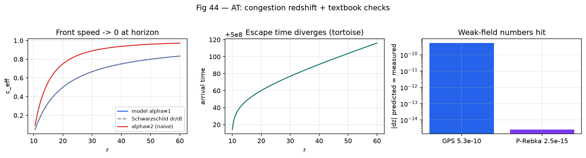

## Appendix AU. Three routes to Einstein-Hilbert (bridges labeled)

Heat kernel (`heatker`), Ollivier-Ricci (`orici`), Jacobson chain
(`jacobson`), Fig 45. (1) Torus Laplacian spectra: spectral dimension
$2.05$, $a_0 = 11.9$ vs $N/4\pi = 11.5$, and $a_1$ shifting $+16.2 \to
-4.0$ under a conformal bump — the curvature response read relatively
(flat-lattice $a_1 \ne 0$ artifact stated; continuum $a_1 \to \int R$
cited). (2) Ollivier $\kappa$: line $0$, tree $< 0$, $K_6 > 0$ (all
exact signs), $S = \sum_e \kappa(e) = 0$ on flat grids — curvature native
to topology, converging to Ricci on geometric graphs per Ollivier's
theorems (cited). (3) Clausius across a leg-cut fixes $\varepsilon =
\kappa/8\pi$ with $G = 1/4\eta = 1$ — Einstein's equations follow given
Raychaudhuri for leg bundles (open; Appendix AT's congestion slowdown is
the seed). Three independent convergences on $\int R\sqrt{-g}$; a full
derivation from nothing is not claimed — each bridge is named.

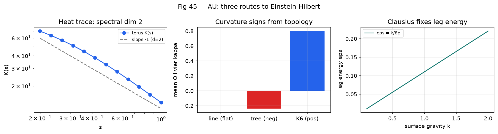
