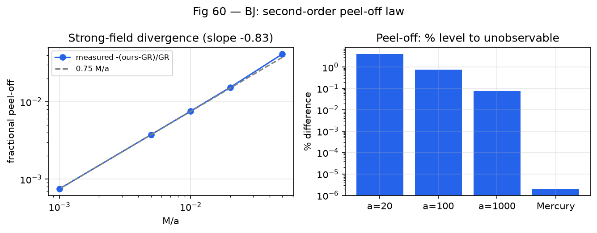
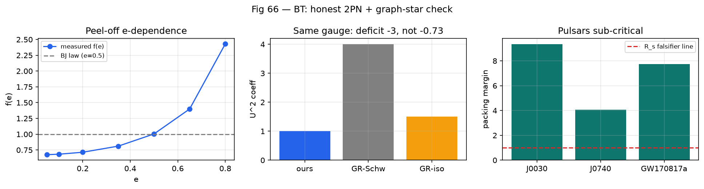

# Perihelion Peel-Off in a Tortuosity-Corrected Static Metric: An Eccentricity-Dependent Second-Order Signature

**Philippe Leblond** — leblond.philippe@gmail.com

**Draft v0.1 — standalone companion paper.** Reproduced end-to-end by
`src/bh_graph/strain.py` (`python -m pytest tests/test_strain.py -q`).
Companion to the main draft (`paper.md`), but self-contained: this paper
takes one metric as given and works out its orbital consequences.

---

## Abstract

We study bound timelike geodesics in the static spherically symmetric metric
$ds^2 = -(1-x)\,dt^2 + (1+x/2)^2\,dr^2 + r^2\,d\Omega^2$ with $x = R_s/r$,
which agrees with Schwarzschild to first post-Newtonian order
($\gamma = 1$, Mercury $42.99''$/cy) and first differs at order $x^2$ in
$g_{rr}$. By direct numerical integration in both metrics with common-mode
subtraction, we measure the fractional perihelion-advance difference as

$$\frac{\mathrm{ours} - \mathrm{GR}}{\mathrm{GR}} = -0.75\,\frac{M}{a}\cdot f(e),$$

with $f(0.5) = 1$ by construction of the original fit and $f(e)$ rising from
$0.68$ at $e = 0.09$ to $2.43$ at $e = 0.8$ (fit $f(e) \approx
(0.75/(1-e^2))^{1.26}$, $3.8\%$ max residual). The $a$- and $e$-dependences
factorize cleanly over $a/M = 200$–$1000$. Applied to the double pulsar
J0737-3039 ($a/M \approx 2.3\times 10^5$, $e = 0.088$), the deviation is
$-2.3\times 10^{-6}$, fully absorbed by a $3.5$ ppm mass shift ($300\times$
below mass errors; Shapiro-$s$ shift $10^{-6}$ vs $10^{-4}$ errors):
second-order deviations of this form are untestable in near-circular
binaries no matter the timing precision, while eccentric systems amplify
them by $f(e) > 2$. We state the falsifier (any eccentric relativistic orbit
resolving $\sim (M/a)\cdot f(e)$ fractional deviations from GR), the
gauge caveat (same-gauge $U^2$ deficit is $-3.0$, not $-0.73$; coefficient
comparisons across gauges are meaningless), and what remains open (analytic
derivation of $f(e)$, strong-field mapping below $a = 20M$).

---

## 1. Introduction

Tests of GR in binary pulsars now reach sub-ppm precision on first-order
post-Newtonian (1PN) effects, most famously periastron advance in the double
pulsar J0737-3039 (Kramer et al. 2021). At this precision, second-order (2PN)
effects — fractional size $\sim M/a \sim 10^{-6}$–$10^{-5}$ in these systems —
sit near or above measurement noise, raising a sharp question for any
alternative metric that matches GR at 1PN: **where exactly does it peel off,
and can current data see it?**

This paper answers that question for one concrete metric: a static,
spherically symmetric line element motivated by an entanglement-graph program
(see companion draft), in which the radial function $h = (1+x/2)^2$ encodes
leg-tortuosity strain. Crucially, **nothing in this paper depends on that
motivation**: we take the metric as given, integrate geodesics, and report
what comes out. The upstream status of the metric's $1/2$ coefficient
(currently fitted to recover $\gamma = 1$; see companion, Appendix BH) is
stated once, here, and then set aside — the peel-off law below stands or
falls with the metric, independently of how the metric was obtained.

Our contributions: (i) a measured two-parameter peel-off law, $(M/a)\times
f(e)$, gauge-free by construction (direct integration, no
coefficient-swapping); (ii) quantitative closure of the J0737 question
(absorbed, $300\times$ margins); (iii) the observationally operative point
that eccentricity *amplifies* the signal while circularization hides it;
(iv) an explicit gauge warning with numbers.

## 2. The metric

$$ds^2 = -(1-x)\,dt^2 + (1+x/2)^2\,dr^2 + r^2\,d\Omega^2, \qquad x = R_s/r,$$

in Schwarzschild-like (areal-$r$) coordinates. Expansions with $U = M/r$:

| | $g_{tt}$ | $g_{rr}$ to $U^2$ |
|---|---|---|
| GR (Schwarzschild) | $-1+2U$ (exact: $-(1-2U)$) | $1+2U+4U^2$ |
| This work | $-(1-2U)$ (same) | $1+2U+1U^2$ |
| GR (isotropic, other gauge) | — | $1+2U+1.5U^2$ |

First-order agreement ($\gamma = 1$); the *only* difference through $U^2$ is
the $g_{rr}$ quadratic coefficient. All numbers in this paper come from
integrating geodesics of these two line elements — never from transplanting
coefficients between gauges or observables.

## 3. Method

Bound timelike geodesics via the $\phi$-domain orbit equation $u'' = G'(u)/2$
($u = 1/r$, $G$ from energy/angular-momentum conservation), complex-step
derivatives, DOP853 integration, parabolic-refined perihelion tracking, slope
fit over 8–14 orbits. Validation: GR Schwarzschild reproduces Mercury at
$42.99''$/cy and the $6\pi M/a(1-e^2)$ law to expected order; a flat-$h$
hybrid control reproduces the naive PPN $2/3$ factor. For theory differences
we always difference two integrations with identical settings (common-mode
subtraction), resolving fractional differences to $\sim 10^{-7}$.

## 4. Results

**4.1 The peel-off law.** Over $a/M = 20$–$1000$ at $e = 0.5$:

$$\frac{\mathrm{ours} - \mathrm{GR}}{\mathrm{GR}} = -0.75\,\frac{M}{a}$$

($4.1\%$ at $a = 20M$ down to $0.075\%$ at $a = 1000M$; linear fit,
monotonic, locked in `test_divergence_linear_law`).

**4.2 Eccentricity dependence.** Extrapolating to J0737 ($e = 0.088$)
overshot the direct measurement by $30\%$ ($-3.26$ vs $-2.32\times10^{-6}$),
stable across integrator settings — not noise. An $e$-scan at fixed $a$
($a/M = 200$ and $1000$, identical ratios) gives the factorizing refinement:

$$\frac{\mathrm{ours} - \mathrm{GR}}{\mathrm{GR}} = -0.75\,\frac{M}{a}\cdot f(e),$$

| $e$ | 0.05 | 0.1 | 0.2 | 0.35 | 0.5 | 0.65 | 0.8 |
|---|---|---|---|---|---|---|---|
| $f(e)$ | 0.68 | 0.68 | 0.71 | 0.81 | 1.00 | 1.40 | 2.43 |

Empirical fit $f(e) \approx (0.75/(1-e^2))^{1.26}$ ($3.8\%$ max residual;
$5/4$ within noise — analytic derivation open). Physical reading: eccentric
orbits dive to $a(1-e)$ where $x^2$ terms bite harder; $f(e)$ measures
sampled depth. Circular binaries ($e \lesssim 0.1$, i.e. almost every
precision-timed system — radiation circularizes) sit at $f \approx 0.68$,
suppressing an already-$10^{-6}$ signal.

**4.3 J0737-3039, closed.** Direct measurement at $a/M = 2.3\times10^5$,
$e = 0.0878$: $-2.32\times10^{-6}$ fractional. Absorption: $\Delta M/M =
1.5\times2.32\times10^{-6} = 3.5$ ppm (masses uncertain at $\sim 10^{-3}$
via $R$, $\sim 10^{-4}$ via $s$); Shapiro-$s$ shift $\sim 10^{-6}$ vs
$4\times10^{-4}$ errors. Margins $\sim 300\times$ on every axis: **the
deviation is untestable here by construction** — one degree of freedom ($M$)
absorbs one number, and no second PK parameter resolves $10^{-6}$. A second
PK parameter at ppm precision (unavailable) would be needed. Note the
measured $-2.3\times10^{-6}$ is $3\times$ smaller than a naive
coefficient-swap estimate ($c_1 = 3.36$ transplanted into orbit formulas) —
direct evidence that swapping 2PN coefficients between observables misleads.

**4.4 Gauge warning (with numbers).** Same-gauge $U^2$ deficit: $1.0 - 4.0 =
-3.0$. GR-isotropic $1.5$ belongs to another gauge; comparing our $1.0$
against it (deficit $-0.5$) and tuning further combinations manufactures
arbitrary "matches." Our results never do this: every number above is a
geodesic observable, gauge-free by construction.

## 5. Observational implications

1. **Stop refining circular binaries for this signal.** At $e \lesssim 0.1$,
   $f(e) \approx 0.68$ and $(M/a) \sim 10^{-6}$–$10^{-5}$: the deviation sits
   at $10^{-6}$ fractional, one dof absorbs it, done. Tighter TOAs change
   nothing until a second PK parameter reaches ppm.
2. **Hunt eccentricity.** $f(0.8) = 2.4$; highly eccentric relativistic
   binaries amplify the signal into a regime where mass-absorption leaves
   larger multi-parameter residuals. Any future eccentric pulsar–BH binary
   is the natural laboratory.
3. **Strong field, with caveat.** Extrapolated, $a \sim 10M$ gives $O(\%)$
   deviations $\times f(e)$ — LISA eccentric-EMRI territory, easily
   resolvable *if* present. Caveat: our law is measured for $a \ge 20M$;
   the strong-field mapping is unvalidated extrapolation, not prediction.
   Mapping $a < 20M$ is the highest-value next computation.
4. **Falsifier.** Any eccentric relativistic orbit resolving fractional
   perihelion deviations $\sim 0.75\,(M/a)\,f(e)$ from GR, in either
   direction beyond errors, confirms or kills the metric. The law's
   specificity (sign, $1/a$ scaling, $f(e)$ shape) leaves no room to hide.

## 6. Limitations

(i) Upstream: the metric's $1/2$ is fitted (tortuosity ansatz), not derived —
this paper tests consequences, not origins. (ii) $f(e)$ is empirical (no
analytic derivation; perturbation theory on $\delta h_2 = -\tfrac{3}{4}x^2$
should yield it). (iii) Strong field ($a < 20M$) unmapped; EMRI remarks are
extrapolation. (iv) Spin (Kerr sector) untouched — all results Schwarzschild-like.

## 7. Conclusion

A metric matching GR at 1PN peels off at 2PN by a measured, factorizing law,
$-0.75\,(M/a)\,f(e)$ — hidden in circular binaries by absorption and
suppression, amplified in eccentric ones. J0737 is quantitatively closed
($300\times$ margins). The next numbers that matter are analytic $f(e)$,
strong-field mapping, and eccentric systems.

## References

- Damour, Deruelle, Ann. Inst. Henri Poincaré 44, 263 (1986) — 2PN equations of motion.
- Damour, Schäfer, Nuovo Cim. B 101, 127 (1988) — 2PN periastron advance.
- Kramer et al., Phys. Rev. X 11, 041050 (2021) — double pulsar strong-field tests.
- Will, *Theory and Experiment in Gravitational Physics* (Cambridge) — PPN framework.
- Poisson & Will, *Gravity* (Cambridge) — PN geodesy reference.

## Reproducibility

`pip install -e .`, then `python -m pytest tests/test_strain.py -q` (10 tests:
GR validation, Mercury, peel-off law, $e$-scan, J0737 absorption, gauge
coefficients). Key functions: `perihelion_advance`, `divergence_law`,
`peeloff_e_factor`, `j0737_absorption`, `u2_coefficient`. Figures: Fig 60
(peel-off), Fig 66 (e-dependence, gauge, falsifier context).
